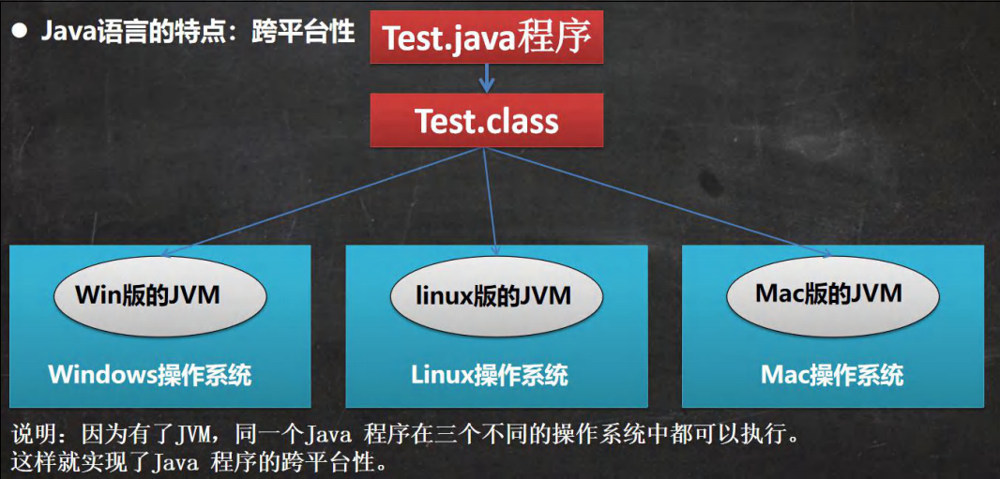

[toc]

# Java运行机制及运行过程

## Java 语言的特点：跨平台性

## Java 核心机制-Java 虚拟机(JVM)

> 1. JVM 是一个虚拟的计算机，具有指令集并使用不同的存储区域。负责执行指令，管理数据、内存、寄存器。包含在 JDK 中。
> 2. 对于不同的平台，有不同的 Java 虚拟机。
> 3. Java 虚拟机机制屏蔽了底层运行平台的差别，实现了“一次编译，到处运行” 。

# JDK、JRE、JVM

## JDK 简介

> 1) JDK 的全称(Java Development Kit：Java 开发工具包) 
>
>     **JDK = JRE + Java 的开发工具**(java, javac, javadoc, javap 等)
>
> 2) JDK 是提供给 Java 开发人员使用的，其中包含了 Java 的开发工具，也包括了 JRE。所以安装了 JDK，就不用在单独安装 JRE 了。

## JRE 简介

> 1) JRE(Java Runtime Environment Java 运行环境) 
>
>     **JRE = JVM + Java 的核心类库(类)**
>
> 2) 包括 Java 虚拟机(JVM Java Virtual Machine) 和 Java 程序所需的核心类库等，如果想要运行一个开发好的 Java 程序，计算机中只需要安装 JRE 即可。

## JDK、JRE 和 JVM 的包含关系 

> 1) **JDK = JRE +** **开发工具集**（例如 Javac，java 编译工具等) 
>
> 2) **JRE = JVM + Java SE** **标准类库**（Java 核心类库） 
>
> 3) 如果只想运行开发好的 .class 文件 只需要 JRE。

