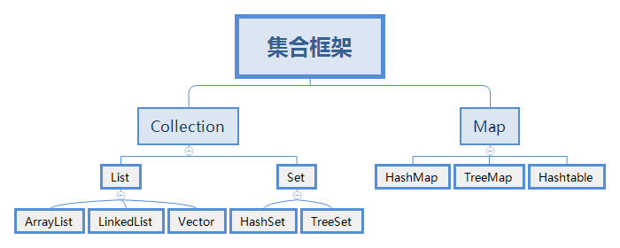

[toc]

# Collections

## 集合体系图



## Collection

> 前面我们学过了__*<u>数组</u>*__，能够用来保存多个数据。
>
> 但__*<u>数组</u>*__有以下几个缺点: 
>
> 1. 数组的长度从创建时就确定了，且一旦确定就不能更改。
> 2. 数组必须保存同一类型的元素。
> 3. 数组的增删操作，需要移动大量的元素。
>
> __*<u>集合:</u>*__
>
> 1. 可以__*<u>动态保存</u>*__任意多个对象。
> 2. 提供了一系列方便的操作对象的方法: add、remove、set、get 等。

> `public interface Collection<E> extends iterable<E>`
>
> 1. Collection 实现子类可以存放多个元素，每个元素可以是 Object。
> 2. 有些 Collection 的实现类，可以存放重复的元素，而有些则不可以。
> 3. 有些 Collection 的实现类，有的是有序的(List)，有些不是有序的(Set)。
> 4. Collection 接口没有直接的实现子类，是通过他的子接口 List 和 Set 来实现的。

### 常用方法

```java
public class Main {
    public static void main(String[] args) {
        List list = new ArrayList();
        
        // add: 添加单个元素
        list.add("ryo");
        list.add(10);
        list.add(true);
        System.out.println(list);
        
        // remove: 删除指定元素
        list.remove(0);
        list.remove(true);
        System.out.println(list);
        
        // contains: 查找元素是否存在
        System.out.println(list.contains("jack"));
        
        // size: 获取元素个数
        System.out.println(list.size());
        
        // isEmpty: 判断是否为空
        System.out.println(list.isEmpty());
        
        // clear: 清空
        list.clear();
        System.out.println("list=" + list);
        
        // addAll: 添加多个元素
        ArrayList list2 = new ArrayList();
        list2.add("红楼梦");
        list2.add("三国演义");
        list.addAll(list2);
        System.out.println("list=" + list);
        
        // containsAll: 查找多个元素是否都存在
        System.out.println(list.containsAll(list2));
        
        // removeAll: 删除多个元素
        list.add("聊斋");
        list.removeAll(list2);
        System.out.println("list=" + list);
    }
}
```


