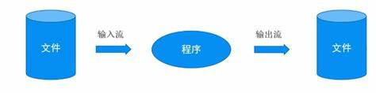

[toc]

# File

## 什么是文件

> ​	文件: __<u>保存数据的地方</u>__。
> ​	如: docx、xlsx、ppt 等都是文件。它即可以保存一张图片，也可以保存一个音频。

## 文件流

> ​	文件在程序中，是以<u>流的形式</u>来操作的。
>
> ​	流: 数据在数据源(文件)和程序(内存)之间，经历的路径。
> ​	输入流: 数据从数据源(文件)到程序(内存)的路径。
> ​	输出流: 数据从程序(内存)到数据源(文件)的路径。

## 文件的操作

### 创建文件对象

| 构造器                                | 说明                                          |
| ------------------------------------- | --------------------------------------------- |
| new File(String pathname)             | 根据路径创建一个 File 对象                    |
| new File(File parent, String child)   | 根据父目录文件路径 + 子路径创建一个 File 对象 |
| new File(String parent, String child) | 根据父目录路径 + 子路径创建一个 File 对象     |

| 方法            | 说明         |
| --------------- | ------------ |
| createNewFile() | 创建新的文件 |

### 获取文件信息

| 方法              | 说明               |
| ----------------- | ------------------ |
| getName()         | 获取文件名字       |
| getAbsolutePath() | 获取文件绝对路径   |
| getParent()       | 获取文件父级目录   |
| length()          | 获取文件大小(字节) |
| exists()          | 判断文件是否存在   |
| isFile()          | 判断是不是一个文件 |
| isDirectory()     | 判断是不是一个目录 |

### 目录的操作

| 方法     | 说明         |
| -------- | ------------ |
| mkdir()  | 创建一级目录 |
| mkdirs() | 创建多级目录 |

### 文件删除

| 方法     | 说明              |
| -------- | ----------------- |
| delete() | 删除空目录 / 文件 |

