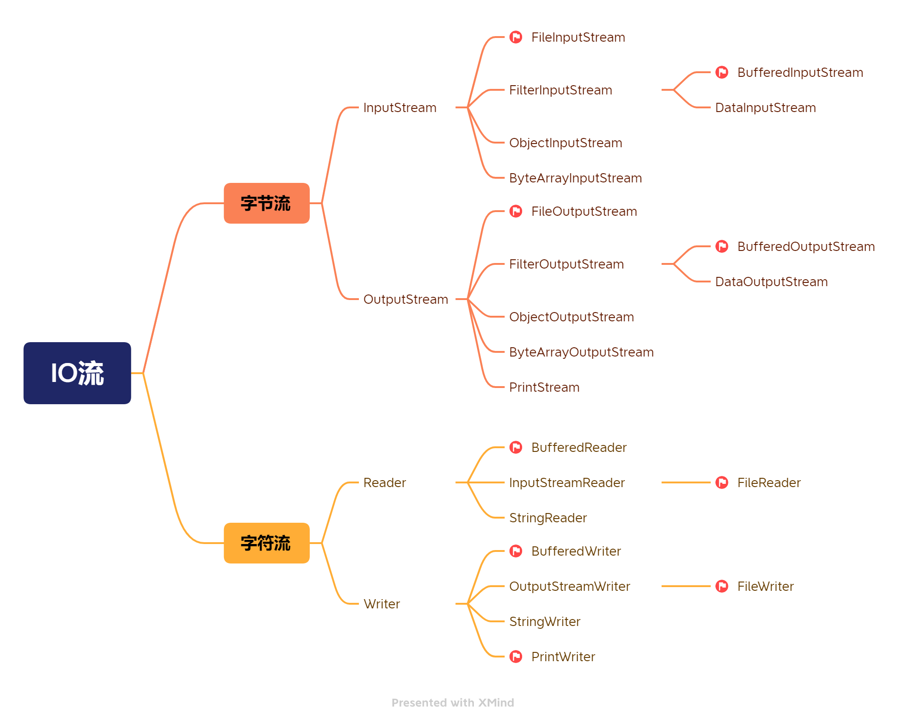

[toc]

# IO 流

## 原理

> 1. I/O 是 Input/Output 的缩写。I/O 技术是非常实用的技术，用于处理数据传输。如读/写文件，网络通讯等。
>
> 2. Java 程序中，对于数据的输入 / 输出操作以 “流(stream)” 的方式进行。
> 3. java.io 包下提供了各种 “流” 的类和接口。用以获取不同种类的数据，并通过方法输入或输出数据。
> 4. 输入 input: 读取外部数据。
>   (磁盘、光盘等存储设备的数据)到程序(内存)中。
> 5. 输出 output: 将程序(内存)的数据输出到磁盘、光盘等存储设备中。

## 分类

> 按操作数据单位不同分为:
> 	字节流(8 bit): 二进制文件
> 	字符流(按字符): 文本文件
>
> 按数据流的流向不同分为:
> 	输入流，输出流
>
> 按流的角色的不同分为: 
> 	节点流，处理流 / 包装流

| 抽象基类 | 字节流       | 字符流 |
| -------- | ------------ | ------ |
| 输入流   | InputStream  | Reader |
| 输出流   | OutputStream | Writer |

## 体系图

