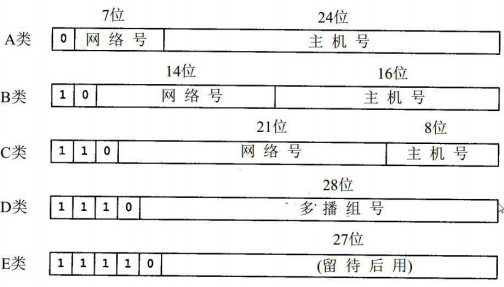
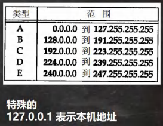
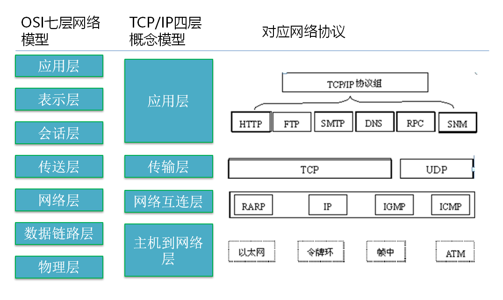
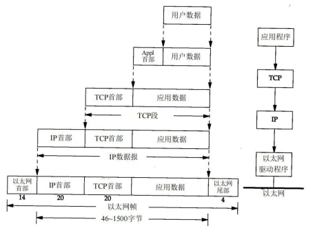

[toc]

# 网络

## 网络通信

> __概念:__ 
> 	两台设备之间通过网络实现数据传输。
> 	即，将数据通过网络，从一台设备传输到另一台设备。
>
> `java.net` 包下提供了一系列的类或接口，用于完成网络通信。

## 网络

> __概念:__ 
> 	两台或多台设备，通过一定物理设备连接起来，构成了网络。
>
> 根据网络的覆盖范围不同，对网络进行__分类:__
> 	*局域网:* 
> 		覆盖范围最小，仅仅覆盖一个教室或一个机房。
> 	*城域网:*
> 		覆盖范围较大，可以覆盖一个城市。
> 	*广域网:* 
> 		覆盖范围最大，可以覆盖全国，甚至全球。万维网是广域网的代表。

## IP 地址

> __概念:__ 
> 	用于唯一标识网络中每台计算机 / 主机。
>
> 查看 IP 地址: ipconfig
>
> IP 地址的__表示形式:__ 
> 	点分十进制。XX.XX.XX.XX
> 	每一个十进制数的范围: 0~255。
>
> IP 地址的__组成:__ 
> 	网络地址 + 主机地址。
> 	如: 192.168.16.69
>
> IPv6 是互联网工程任务组设计的用于替代IPv4的下一代IP协议。
> ​其地址数量号称可以为全世界的每一粒沙子编上一个地址。
>
> 由于 IPv4 最大的问题在于网络地址资源有限，严重制约了互联网的应用和发展。	
> IPv6的使用，不仅能解决网络地址资源数量的问题，而且也解决了多种接入设备连入互联网的障碍。

## IPv4

## 域名

> __概念:__ 
> 	将 IP 地址映射成域名(通过 HTTP 协议)。
> 	例如: www.baidu.com
>
> 域名的__好处:__ 
> 	为了方便记忆，解决记 IP 的困难。
>
> __端口号__
>
> __概念: __
> 	用于标识计算机上某个特定的网络程序。
>
> __表示形式:__ 
> 	以整数形式，端口范围 0 ~ 65535(2 个字节表示端口 0 ~ 2^16^-1)
> 	1024 已经被占用。比如: ssh(22), ftp(21), smtp(25), http(80)
>
> 常见的网络程序端口号:
> 	tomcat: 8080
> 	mysql: 3306
> 	oracle: 1521
> 	sqlserver: 1433

## 网络通信协议

> __协议(TCP/IP): __
>
> ​	TCP/IP(Transmission Control Protocol/lnternet Protocol)的简写
> ​	中文译名为: 传输控制协议 / 因特网互联协议，又叫网络通讯协议。
> ​	这个协议是 Internet 最基本的协议，Internet国际互联网络的基础。
> ​	即，就是由网络层的 IP 协议和传输层的 TCP 协议组成的。

## TCP UDP

> __TCP 协议(传输控制协议): __
>
> 1. 使用TCP 协议前，须先建立 TCP 连接，形成传输数据通道。
>
> 2. 传输前，采用 "三次握手" 方式，是可靠的
>
> 3. TCP 协议进行通信的两个应用进程: 客户端、服务端。
>
> 4. 在连接中可进行大数据量的传输。
>
> 5. 传输完毕，需释放已建立的连接，效率低。
>
> __UDP 协议(用户数据协议):__
>
> 1. 将数据、源、目的封装成数据包，不需要建立连接。
> 2. 每个数据报的大小限制在 64K 内，不适合传输大量数据。
> 3. 因无需连接，故是不可靠的。
> 4. 发送数据结束时无需释放资源(因为不是面向连接的)，速度快。
> 5. 举例: 厕所通知: 发短信。

## netstat

> 1. netstat -an 可以查看当前主机网络情况，包括端口监听情况和网络连接情况
>
> 2. netstat -an | more可以分页显示
>
> 3. 要求在dos控制台下执行win+r
>
>   说明:
>   (1) Listening 表示某个端口在监听。
>   (2) 如果有一个外部程序(客户端)连接到该端口，就会显示一条连接信息。
>   (3) 可以输入 ctrl +c 退出指令。
