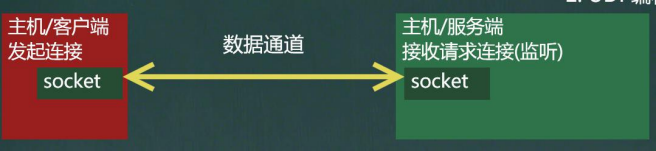

[toc]

# Socket

## 基本概念

> __套接字(Socket)__开发网络应用程序被广泛采用，以至于成为事实上的标准。
>
> 通信的两端都要有 Socket，是两台机器间通信的端点。网络通信其实就是Socket间的通信。
>
> Socket 允许程序把网络连接当成一个流，数据在两个 Socket 之间通过 IO 传输。
>
> 一般主动发起通信的应用程序属客户端，等待通信请求的为服务端。

