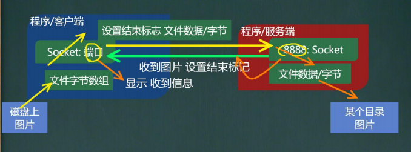

[toc]

# TCP 编程

## 基本介绍

> 1.基于客户端—服务端的网络通信
>
> 2.底层使用的是TCP/IP协议
>
> 3.应用场景举例:客户端发送数据，服务端接受并显示控制台
>
> 4.基于Socket的TCP编程

## 细节

​	当客户端连接到服务端后，实际上客户端也是通过一个端口和服务端进行通讯的。

​	这个端口是TCP/IP来分配的，是不确定的，是随机的。

​	程序验证 + netstat。