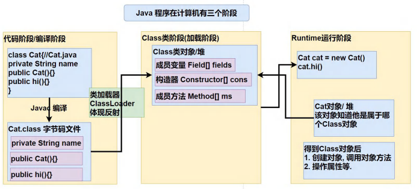

[toc]

# Reflection

## Java 反射

> 1. 反射机制 允许程序在执行期借助于 Reflection API 取得任何类的内部信息(比如成员变量,构造器,成员方法等)。
>     并能操作对象的属性及方法。
>     反射在设计模式和框架底层都会用到。
> 2. 在加载完类之后，堆中就产生了一个 Class 类型的对象(一个类只有一个 Class 对象)。
>     这个对象包含了类的完整结构信息，通过这个对象就可以得到类的结构。
>     这个 Class 对象就像一面镜子，透过这个镜子看到类的结构。
>     所以形象的称之为: 反射。

## Java 反射的原理

## Java 反射机制能做

1. 在运行时判断任意一个对象所属的类。
2. 在运行时构造任意一个类的对象。
3. 在运行时得到任意一个类所具有的成员变量和方法。
4. 在运行时调用任意一个对象的成员变量和方法。
5. 生成动态代理。

## Java 反射相关的类

1. java.lang.Class: 代表一个类，Class 对象表示某个类加载后在堆中的对象。
2. java.lang.reflect.Method: 代表类的方法，Method对象表示某个类的方法。
3. java.lang.reflect.Field: 代表类的成员变量, Field对象表示某个类的成员变量。
4. java.lang.reflect.Constructor: 代表类的构造方法, Constructor对象表示构造器。