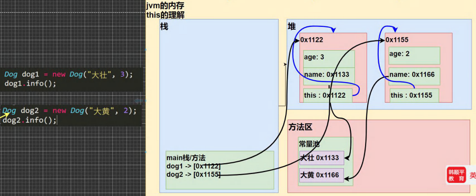

[toc]

# this 关键字

## 什么是 this？

> ​	Java 虚拟机会给每个对象分配一个 this，用来代表当前对象。

```java
public Dog(String name, int age) {
    this.name = name;
    this.age = age;
}
@Override
public int hashCode() {
    return Objects.hash(name, age);
}

@Override
public String toString() {
    return "Dog{" +
            "name='" + name + '\'' +
            ", age=" + age +
            '}';
}
```

## this 原理



## 使用细节

1) this 关键字可以用来访问本类的属性、方法、构造器。

2) this 用于区分当前类的属性和局部变量。

3) 访问成员方法的语法：this.方法名(参数列表)。

4) 访问构造器语法：this(参数列表); 注意只能在构造器中使用(即只能在构造器中访问另外一个构造器, 必须放在第一条语句)。

    ```java
    public Dog() {
        this("YelloDog", 1);
    }
    ```

5) this 不能在类定义的外部使用，只能在类定义的方法中使用。

