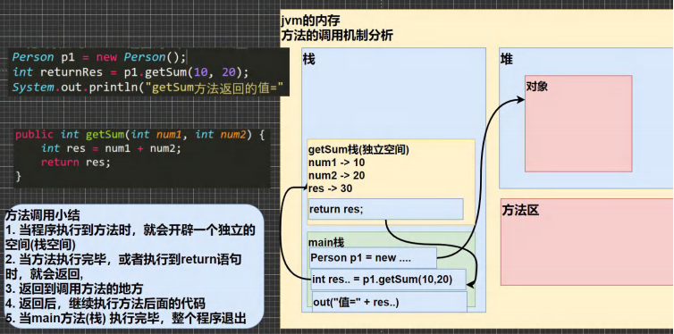

[toc]

# 成员方法

## 介绍

> ​	在某些情况下，我们要需要定义**成员方法(方法)**。
> ​	比如：人除了有一些属性之外(年龄，姓名..)，我们人类还有一些行为(可以说话、跑步，通过学习，还可以做算术题)。
>
> ​	这时就要用成员方法才能完成。

## 成员方法的定义

```java
访问修饰符 返回数据类型 方法名(形参列表..) {
    //方法体 
    语句； 
    return 返回值; 
}
```

## 成员方法的好处

> 1) 提高代码的复用性。
>
> 2) 可以将实现的细节封装起来，然后供其他用户来调用即可。

## 示例

~~~java
public class Method01 { 
    //编写一个 main 方法 
    public static void main(String[] args) { 
        //方法使用 
        //1. 方法写好后，如果不去调用(使用)，不会输出 
        //2. 先创建对象 ,然后调用方法即可 
        Person p1 = new Person(); 
        p1.speak(); //调用方法 
    } 
}
~~~

~~~java
class Person { 
    // 属性
    String name; 
    int age; 
    
    //方法(成员方法) 
    //添加 speak 成员方法,输出 “我是一个好人” 
    //1. public 表示方法是公开 
    //2. void ： 表示方法没有返回值 
    //3. speak() : speak 是方法名， () 形参列表 
    //4. {} 方法体，可以写我们要执行的代码 
    //5. System.out.println("我是一个好人"); 表示我们的方法就是输出一句话 
    public void speak() { 
        System.out.println("我是一个好人"); 
    }
    
    //添加 getSum 成员方法,可以计算两个数的和
    //1. public 表示方法是公开的 
    //2. int :表示方法执行后，返回一个 int 值 
    //3. getSum 方法名 
    //4. (int num1, int num2) 形参列表，2 个形参，可以接收用户传入的两个数 
    //5. return res; 表示把 res 的值， 返回 
    public int getSum(int num1, int num2) {
        int res = num1 + num2; 
        return res; 
    } 
}
~~~

## 方法的调用机制原理



## 注意事项与细节

### 访问修饰符

- 控制方法的使用范围。

- 如果没写，则是默认访问修饰符。
    	`public、protected、默认、private`。

### 返回类型

1. 一个方法最多有一个返回值。
2. 返回类型可以为任意类型，包括基本类型和引用类型(数组、对象)。
3. 如果方法要求有返回数据类型，则方法体中最后执行的语句一定是 `return`，而且要求返回值类型必须和 `return` 的值类型一致或兼容。
4. 如果方法是 `void`，则方法体中可以没有 `return` 语句，或者写 `return ;`。

### 方法名

- 遵循驼峰命名法。

### 形参列表

1. 一个方法可以有 0 个参数，也可以有多个参数，中间用逗号隔开。

2. 参数类型可以为任意类型，包含基本类型和引用类型。

3. 调用带参数的方法时，必须对应参数列表传入相同类型或兼容类型。

4. 方法定义时的参数称为形式参数(形参)；

    方法调用时的参数称为实际参数(实参)。
    实参与形参的类型要一致或兼容。个数、顺序必须保持一致。

### 方法体

- 方法体为完成该功能的具体语句。
    可以为输入、输出、变量、运算符、分支、循环、调用等。
    但方法体内不能再定义方法。
