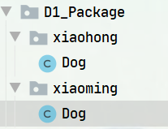

[toc]

# 包

> ​	当不同程序员同时开发一个项目时，程序员 A 定义了一个类 `Dog`，而程序员 B 也定义了一个类 `Dog`。
>
> ​	那么如何区分这两个类呢？

## 作用

1. 区分相同名字的类。
2. 可以很好的管理类(见 JavaAPI 文档)。
3. **<span style="color: red">控制访问范围。</span>**

## 基本语法

```java
// 打包
package java.util.List

// 导包
import java.util.Map;
```

### 说明

- `package`：打包。
- `java.util.List`：包名。

## 包的本质(原理)

> 包的本质：
> 	创建不同的文件夹 / 目录来保存文件。



## 包的命名

### 规则

> ​	只能包含数字、字母、下划线、点。不能以数字开头，不能是关键字 / 保留字。

### 规范

> ​	一般是小写字母 + 点。
>
> ​	如：
> ​		com.公司名.项目名.业务模块名
> ​		com.yyt.oa.user;

## 使用细节

> ​	`package` 的作用是申明当前类所在的包，需要放在类的最上面，且只能有一个。
>
> ​	`import` 放在 `package` 的下面，在类的定义前面，可以有多个，且没有顺序要求。