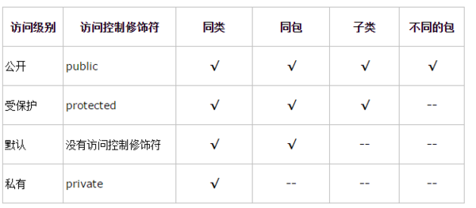

[toc]

# 访问修饰符

## 概述

> ​	Java 提供了**四种访问控制修饰符**，用于**控制属性、方法以及类(接口) 的访问权限(范围)：**

| 级别     | 修饰符    | 说明                                                         |
| -------- | --------- | ------------------------------------------------------------ |
| 公开的   | public    | 对外公开。                                                   |
| 受保护的 | protected | 对子类、同一个包中的类公开。 |
| 默认的   |           | 对同一个包的类公开。         |
| 私有的   | private   | 对类本身公开。               |

## 访问范围

## 使用细节

1. 修饰符可以用来修饰**类中的属性、方法以及类。**
2. 只有**默认和 `public` 才能修饰类。**
3. 子类的访问权限([继承]())。
4. 成员方法的访问规则和属性一致。