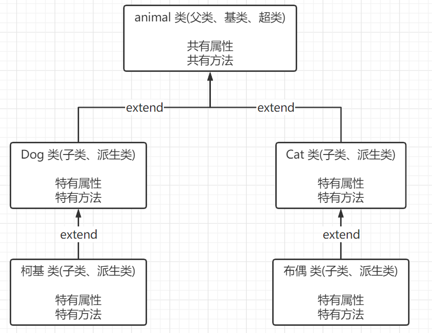
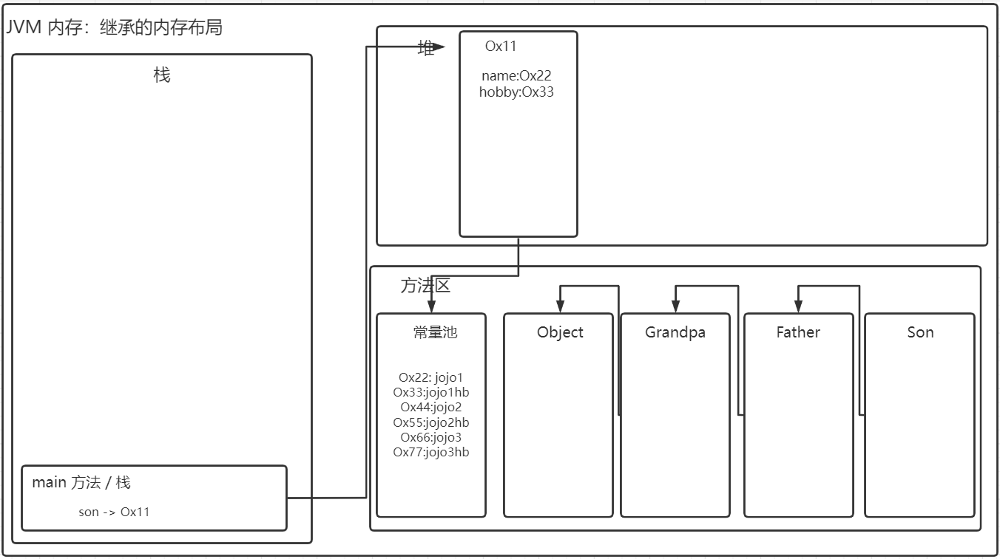

[toc]

# 继承

> ​	当我们编写了两个类，一个 `Pupil` 类，一个 `Graduate` 类。
>
> ​	然而两个类中*<span style="color: green">许多属性和方法都是相同的</span>*。

## 概述

> ​	继承可以解决代码复用，使得编程更加靠近人类的思维。
>
> ​	当多个类存在*<span style="color: green">相同的属性(变量)和方法</span>*时，可以从这些类中抽象出父类。
> ​	在父类中定义这些相同的属性和方法。
> ​	所有的子类不需要重新定义这些属性和方法，只需要通过 `extends` 来声明继承父类即可。

## 原理图



## 基本语法

```java
class Dog extend Animal {
    // 1. 子类自动拥有父类中定义的属性与方法。
    // 2. 父类又称基类、超类。
    // 3. 子类又称派生类。
}
```

## 继承的好处

1) 提高了代码的复用性。

2) 提高了代码的扩展性和维护性。

## 使用细节

1) <span style="color: green">子类继承了父类的所有属性和方法。其中非私有的属性和方法可以在子类直接访问, 但是私有的属性和方法不能在子类直接访问，需要通过父类提供的公共的方法来访问。</span> 

2) 子类必须调用父类的构造器，完成父类的初始化(隐藏使用了 `super()` )。

3) 当创建子类对象时，不管使用子类的哪个构造器，默认情况下总会去调用父类的无参构造器。
    如果父类没有提供无参构造器，则必须在子类的构造器中用 `super()` 去指定使用父类的哪个构造器完成对父类的初始化工作。否则，编译不会通过。 

4) 如果希望指定去调用父类的某个构造器，则显式的调用一下: `super(参数列表)`。

5) `super` 在使用时，必须放在构造器第一行(`super` 只能在构造器中使用)。

6) `super()` 和 `this()` 都只能放在构造器第一行，因此这两个方法不能共存在一个构造器。

7) Java 所有类都是 `Object` 类的子类, `Object` 是所有类的基类(CTRL + H 查看关系)。

8) 父类构造器的调用不限于直接父类！将一直往上追溯直到 `Object` 类(顶级父类)。

9) 子类最多只能继承一个父类(指直接继承)，即 Java 中是单继承机制。 
    思考：如何让 A 类继承 B 类和 C 类？-- A 继承 B，B 继承 C。 

10) 不能滥用继承，子类和父类之间必须满足 is-a 的逻辑关系(Dog is a Animal)。

## 继承的本质

> ​	当子类继承了父类，创建子类对象时，内存中发生了什么。



### 当访问属性时，如何访问的？

1) 首先看子类是否有该属性。

2) 如果子类有这个属性，并且可以访问，则返回信息。

3) 如果子类没有这个属性，就看父类有没有这个属性(如果父类有该属性，并且可以访问，就返回信息..)。

4) 如果父类没有就按照(3)的规则，继续找上级父类，直到 Object...

## 示例

```java
public class Student01 {
    // 共有属性
    public String name;
    public int age;
    private double score;   //成绩

    // 共有的方法
    public void setScore(double score) {
        this.score = score;
    }

    public void showInfo() {
        System.out.println("学生名 " + name + " 年龄 " + age + " 成绩 " + score);
    }
}
```

```java
public class Pupil01 extends Student01 {
	// 特有方法
    public void testing() {
        System.out.println("小学生：" + name + " 正在考小学数学..");
    }
}
```

