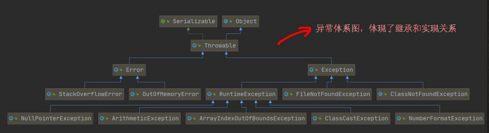

[toc]

# Exception

## 概述

> ​	Java 语言中，将程序执行过程中发生的不正常情况称之为“*<u>异常</u>*”。(开发过程中的语法错误和逻辑错误不是异常)

### 执行过程中发生的异常

- Error(错误)：JVM 无法解决的严重问题。Error 是严重错误，程序会崩溃。
    如：JVM 系统内部错误、资源耗尽等严重情况。
- Exception：其他因编程错误或偶然的外在因素导致的一般性问题，可以使用针对性的代码进行处理。
    `Exception` 分为两大类：<u>运行时异常</u>和<u>编译时异常</u>。 
    如：空指针异常、试图读取不存在的呃文件、网络连接中断等。

# 异常体系图

## 总结

1. __异常分为两大类: __<u>运行时异常</u>和<u>编译时异常</u>。
2. <u>运行时异常</u>: 编译期间查不出来的异常。一般是指编程时的逻辑错误。
    `RunntimeException` 及其子类都是运行时异常。
3. 对于运行时异常，可以不做处理，因为这类异常很普遍，若全处理可能对程序的可读性和运行效率产生影响。
4. <u>编译时异常</u>: 是编译器要求必须处理的异常。
