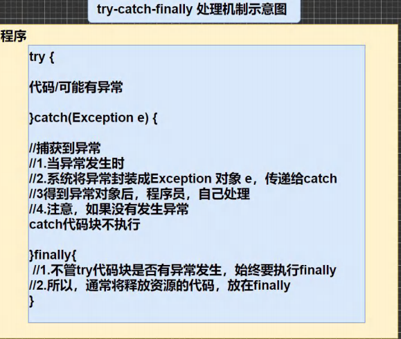
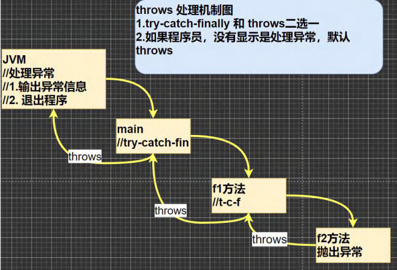

[toc]

# 异常的处理

## 基本介绍

> ​	异常的处理: 就是当异常发生时，对异常处理的方式。

## 两种方式

> 1. `try-catch-finally`: 
>     程序员在代码中捕获发生的异常，自行处理。
> 2. `throws`:
>     将发生的异常抛出，交给调用者(方法)来处理，最顶级的处理者是 JVM。

## 示意图

### try-catch-finally 示意图



### throws 示意图



## try-catch 的异常处理

> ​	Java 提供 `try` 和 `catch` 块来处理异常。
> ​	`try` 块用于包含可能出错的代码。`catch` 块用于处理 `try` 块中发生的异常。可以根据需求，在程序里写多个 `catch` 块。

### 基本语法

```java
try {
	code;
} catch(Exception e) {
	handle;
} catch(Exception e) {
    handle;
} ... 
  finally {
      // 如果没有 finally，也是可以的。
  }
```

### 细节

1. 如果异常发生了，则异常发生的后面代码不会执行，直接进入到 `catch` 块里。
2. 如果异常没有发生，则顺序执行完 `try` 块，不会进入到 `catch` 块里。
3. 如果希望不管是否发生异常，都指向某代码块(比如关闭连接、私服资源等)，则使用 `finally` 块。
4. 可以有多个 `catch` 块，捕获不同的异常(进行不同的业务处理)，要求父类异常在后，子类异常在前。
    如: Exception 在后，NullPointerException 在前。
    如果发生异常，只会匹配一个 `catch`。
5. 可以进行 `try-finally` 配合使用，这种用法<u>相当于没有捕获异常</u>。因此程序会直接崩掉 / 退出。

## throws 的异常处理

> 1. 如果一个方法可能产生某种异常，但不能确定如何处理这种异常，则此方法应显示的声明抛出异常，表明该方法将部队这些异常进行处理，而由该方法的调用者负责处理。
> 2. 在方法声明中用 `throws` 语句可以声明抛出异常的列表。`throws` 后面的异常类型可以是方法中产生的异常类型，也可以是它的父类。

### 细节

1. 对于编译异常，程序中必须处理，比如 `try-catch`或者 `throws`。
2. 对于运行时异常，程序中如果没有处理，默认就是 `throws` 的方式处理。
3. 子类重写父类的方法时，对抛出异常的规定: 子类重写的方法，所抛出的异常类型要么和父类抛出的异常一致，要么为父类抛出的异常的类型的子类型。
4. 在 `throws` 过程中，如果有方法 `try-catch`，就相当于处理异常，就可以不必throws。